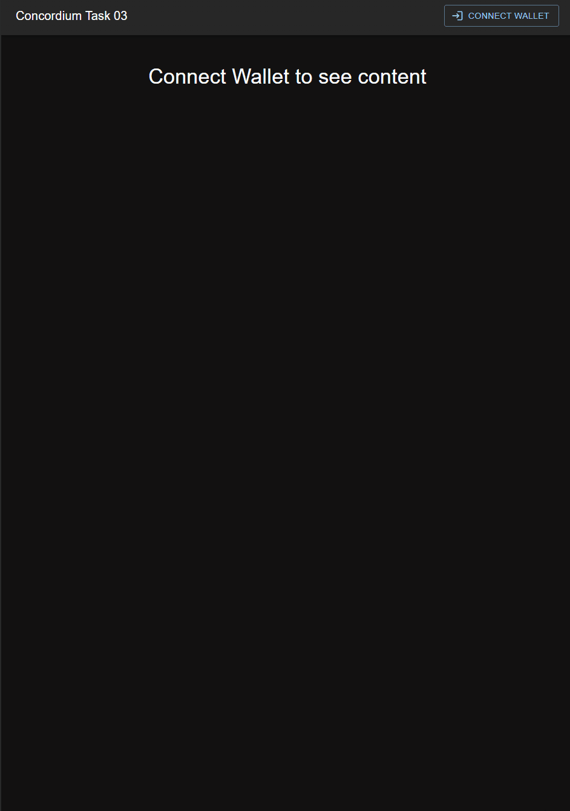

### Concordium Task 03
* This is a basic Counter Dapp that uses a contract hosted on the Concordium Testnet, this dapp reflects the contract update procedure and the invokes for fetching its state
* Mainnet Address ```2xBLr1bosK5NEQJTW9q1GHsmmuDgLrjAAzC8CSUBJc55AwVsw5```
<hr/>
#### Video GIF
  